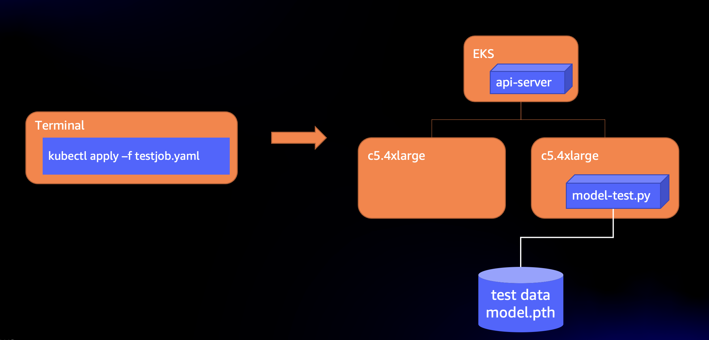

# Distributed Model Training Workshop for AWS EKS

Welcome! By completing this workshop you will learn how to run distributed data parallel model training on [AWS EKS](https://aws.amazon.com/eks) using [PyTorch](https://pytorch.org). 
The only prerequisite for this workshop is access to an AWS account. The steps included here will walk you through creating and AWS EKS cluster, a shared data volume, building a model training container image, downloading and pre-processing data, running distributed training of an image classification model, and finally running the model with new images to test it.

The workshop architecture at a high level can be visualized by the diagram below.

<center> </br>

Fig. 1 - Workshop Infrastructure Architecture
</center>

The workshop is designed to introduce the concepts of deploying this architecture and running small-scale distributed training for educational purposes, however the same architecture can be applied for training at large scale by adjusting the number and type of nodes used in the EKS cluster, using accelerators ([NVIDIA GPUs](https://aws.amazon.com/nvidia/), [AWS Trainium](https://aws.amazon.com/machine-learning/trainium/), [Intel Habana Gaudi](https://aws.amazon.com/ec2/instance-types/dl1/)), and high-performance shared storage like [FSx for Lustre](https://aws.amazon.com/fsx/lustre/). Further information and scripts that help deploy distributed training on EKS using GPUs and FSx can be found in the [aws-do-eks](https://github.com/aws-samples/aws-do-eks) open-source project.

This workshop is organized in a number of sequential steps. The scripts that belong to each step are organized in folders with corresponding names. To execute a step, we will change the current directory accordingly and execute scripts in their designated order. The prerequisites section is required, but there are no scripts associated with it. We will complete setting up prerequisites by following instructions. Steps 1 through 6 are required to complete the workshop. Step 7-Cleanup is optional. 

## 0. Prerequisites
Before we get started, we need to set up an AWS account and Cloud9 IDE from which we will execute all the steps in the workshop. You will not be required to install anything on your computer. All of the steps in the workshop will be completed on the cloud through your browser. To set up your account and IDE, please follow the instructions in [SETUP.md](SETUP.md).

## 1. Create EKS Cluster

<center> </br>

Fig. 1.0 - Step 1 - Create EKS cluster
</center>

In this step we will execute scripts to create a managed [Kubernetes](https://kubernetes.io) cluster using the Amazon Elastic Kubernetes Service ([EKS](https://aws.amazon.com/eks)). Later we will use this cluster to run our distributed model training job.

In the last part of your prerequisites setup, you cloned the workshop code into your Cloud9 IDE. To build our distributed training infrastructure on EKS, we will start by changing the current directory to `1-create-cluster`.

```console
cd 1-create-cluster
```

### 1.1. Configure AWS client and EKS cluster
Many of the scripts provided in the workshop use the [AWS CLI](https://aws.amazon.com/cli/) to access the AWS APIs in the account. That is why the AWS CLI needs to be configured with the credentials (access key id and secret access key) we saved previously. The configuration of the EKS cluster is specified by a .yaml file which we will also generate in this step. 

Execute:
```console
./1-1-configure.sh
```

Output:
```
The config profile (workshop) could not be found

Configuring AWS client ...
AWS Access Key ID [None]: ************
AWS Secret Access Key [None]: ****************************************
Default region name [None]: us-west-2
Default output format [None]: json

Generating cluster configuration eks.yaml ...
```

By default, Cloud9 uses AWS managed temporary credentials, which we override with the script. If the managed temporary credentials setting has not been disabled, as soon as the script completes, Cloud9 will display the following dialog.

<center>
 
&nbsp;&nbsp;&nbsp;&nbsp;&nbsp;&nbsp; 
 
</br>

Fig. 1.1 Cloud9 credentials dialogs
</center>

Please click **Cancel** in this dialog, immediatlely another dialog appears. Please click **Permanently disable** in the second dialog. If these dialogs do not appear, then AWS managed temporary credentials have already been disabled in your Cloud9 IDE and you may proceed to the next step.

### 1.2. Install tools

The Cloud9 IDE comes with Docker pre-installed. In order to provision an EKS cluster, we will install [eksctl](https://eksctl.io/). To be able to execute commands against Kubernetes, we will install [kubectl](https://kubernetes.io/docs/tasks/tools/install-kubectl-linux/). We will also install other miscellaneous utilities like [kubectx](https://github.com/ahmetb/kubectx), [kubetail](https://github.com/johanhaleby/kubetail), [jq](https://github.com/stedolan/jq), [yq](https://kislyuk.github.io/yq/), and will set up some shorthand command aliases (ll='ls -alh', k=kubectl, kc=kubectx, kn=kubens, kt=kubetail, ks=kubeshell) for convenience.

Execute:
```console
./1-2-install-tools.sh
```

Output:
```
Installing eksctl ...
  % Total    % Received % Xferd  Average Speed   Time    Time     Time  Current
                                 Dload  Upload   Total   Spent    Left  Speed
  0     0    0     0    0     0      0      0 --:--:-- --:--:-- --:--:--     0
100 18.6M  100 18.6M    0     0  19.1M      0 --:--:-- --:--:-- --:--:-- 31.5M
0.66.0

Installing kubectl ...
  % Total    % Received % Xferd  Average Speed   Time    Time     Time  Current
                                 Dload  Upload   Total   Spent    Left  Speed
100 57.4M  100 57.4M    0     0  93.6M      0 --:--:-- --:--:-- --:--:-- 93.6M
Client Version: version.Info{Major:"1", Minor:"19+", GitVersion:"v1.19.6-eks-49a6c0", GitCommit:"49a6c0bf091506e7bafcdb1b142351b69363355a", GitTreeState:"clean", BuildDate:"2020-12-23T22:13:28Z", GoVersion:"go1.15.5", Compiler:"gc", Platform:"linux/amd64"}

...

Setting up aliases ...

Done setting up tools.
```

### 1.3. Launch cluster

We will use `eksctl` and the generated `eks.yaml` configuration to launch a new EKS cluster.

Execute:
```console
./1-3-create-cluster.sh
```

Output:
```
Creating EKS cluster ...

... using configuration from ./eks.yaml ...

apiVersion: eksctl.io/v1alpha5
kind: ClusterConfig

metadata:
  name: do-eks
  version: "1.21"
  region: us-west-2

availabilityZones:
  - us-west-2a
  - us-west-2b

iam:
  withOIDC: true

managedNodeGroups:
  - name: wks-node
    instanceType: c5.4xlarge
    instancePrefix: workshop
    privateNetworking: true
    availabilityZones: ["us-west-2a","us-west-2b"]
    efaEnabled: false
    minSize: 0
    desiredCapacity: 2
    maxSize: 10
    volumeSize: 900
    iam:
      withAddonPolicies:
        cloudWatch: true
        autoScaler: true
        ebs: true

Sat Jun  4 06:06:16 UTC 2022
eksctl create cluster -f ./eks.yaml
2022-06-04 06:06:16 [ℹ]  eksctl version 0.66.0
2022-06-04 06:06:16 [ℹ]  using region us-west-2
2022-06-04 06:06:16 [ℹ]  subnets for us-west-2a - public:192.168.0.0/19 private:192.168.64.0/19
2022-06-04 06:06:16 [ℹ]  subnets for us-west-2b - public:192.168.32.0/19 private:192.168.96.0/19
2022-06-04 06:06:16 [ℹ]  nodegroup "wks-node" will use "" [AmazonLinux2/1.21]
2022-06-04 06:06:16 [ℹ]  using Kubernetes version 1.21
2022-06-04 06:06:16 [ℹ]  creating EKS cluster "do-eks" in "us-west-2" region with managed nodes
2022-06-04 06:06:16 [ℹ]  1 nodegroup (wks-node) was included (based on the include/exclude rules)
2022-06-04 06:06:16 [ℹ]  will create a CloudFormation stack for cluster itself and 0 nodegroup stack(s)
2022-06-04 06:06:16 [ℹ]  will create a CloudFormation stack for cluster itself and 1 managed nodegroup stack(s)
2022-06-04 06:06:16 [ℹ]  if you encounter any issues, check CloudFormation console or try 'eksctl utils describe-stacks --region=us-west-2 --cluster=do-eks'
2022-06-04 06:06:16 [ℹ]  CloudWatch logging will not be enabled for cluster "do-eks" in "us-west-2"
2022-06-04 06:06:16 [ℹ]  you can enable it with 'eksctl utils update-cluster-logging --enable-types={SPECIFY-YOUR-LOG-TYPES-HERE (e.g. all)} --region=us-west-2 --cluster=do-eks'
2022-06-04 06:06:16 [ℹ]  Kubernetes API endpoint access will use default of {publicAccess=true, privateAccess=false} for cluster "do-eks" in "us-west-2"
2022-06-04 06:06:16 [ℹ]  2 sequential tasks: { create cluster control plane "do-eks", 3 sequential sub-tasks: { 4 sequential sub-tasks: { wait for control plane to become ready, associate IAM OIDC provider, 2 sequential sub-tasks: { create IAM role for serviceaccount "kube-system/aws-node", create serviceaccount "kube-system/aws-node" }, restart daemonset "kube-system/aws-node" }, 1 task: { create addons }, create managed nodegroup "wks-node" } }
2022-06-04 06:06:16 [ℹ]  building cluster stack "eksctl-do-eks-cluster"
2022-06-04 06:06:16 [ℹ]  deploying stack "eksctl-do-eks-cluster"

...

2022-06-04 06:27:59 [ℹ]  waiting for CloudFormation stack "eksctl-do-eks-nodegroup-wks-node"
2022-06-04 06:27:59 [ℹ]  waiting for the control plane availability...
2022-06-04 06:27:59 [✔]  saved kubeconfig as "/home/ec2-user/.kube/config"
2022-06-04 06:27:59 [ℹ]  no tasks
2022-06-04 06:27:59 [✔]  all EKS cluster resources for "do-eks" have been created
2022-06-04 06:30:01 [ℹ]  kubectl command should work with "/home/ec2-user/.kube/config", try 'kubectl get nodes'
2022-06-04 06:30:01 [✔]  EKS cluster "do-eks" in "us-west-2" region is ready

Sat Jun  4 06:30:01 UTC 2022
Done creating EKS cluster

Updating kubeconfig ...
Added new context arn:aws:eks:us-west-2:620266777012:cluster/do-eks to /home/ec2-user/.kube/config


Displaying cluster nodes ...
NAME                                            STATUS   ROLES    AGE    VERSION
ip-192-168-111-138.us-west-2.compute.internal   Ready    <none>   3m3s   v1.21.12-eks-5308cf7
ip-192-168-90-82.us-west-2.compute.internal     Ready    <none>   3m3s   v1.21.12-eks-5308cf7

```

The `eksctl` command uses Cloud Formation behind the scenes. In addition to the command output, provisioning progress can be seen in [CloudFormation](https://us-west-2.console.aws.amazon.com/cloudformation/home?region=us-west-2#).

Please expect that creation of the cluster may take up to 30 min.

### 1.4. Deploy packages to cluster
We are going to use [TorchElastic Job Controller](https://github.com/pytorch/elastic/tree/master/kubernetes) for Kubernetes to launch a distributed training job using an ElasticJob custom resource. We will also use [Kubernetes Metrics Server](https://github.com/kubernetes-sigs/metrics-server) to monitor node resource utilization in the cluster during training. To deploy both to the EKS cluster, execute:

```console
./1-4-deploy-packages.sh
```

Output:
```
Deploying Kubernetes Metrics Server ...
serviceaccount/metrics-server created
clusterrole.rbac.authorization.k8s.io/system:aggregated-metrics-reader created
clusterrole.rbac.authorization.k8s.io/system:metrics-server created
rolebinding.rbac.authorization.k8s.io/metrics-server-auth-reader created
clusterrolebinding.rbac.authorization.k8s.io/metrics-server:system:auth-delegator created
clusterrolebinding.rbac.authorization.k8s.io/system:metrics-server created
service/metrics-server created
deployment.apps/metrics-server created
apiservice.apiregistration.k8s.io/v1beta1.metrics.k8s.io created

Deploying Torch Elastic ...
namespace/elastic-job created
Warning: apiextensions.k8s.io/v1beta1 CustomResourceDefinition is deprecated in v1.16+, unavailable in v1.22+; use apiextensions.k8s.io/v1 CustomResourceDefinition
customresourcedefinition.apiextensions.k8s.io/elasticjobs.elastic.pytorch.org created
role.rbac.authorization.k8s.io/leader-election-role created
clusterrole.rbac.authorization.k8s.io/elastic-job-k8s-controller-role created
rolebinding.rbac.authorization.k8s.io/leader-election-rolebinding created
clusterrolebinding.rbac.authorization.k8s.io/elastic-job-k8s-controller-rolebinding created
deployment.apps/elastic-job-k8s-controller created

Deploying etcd ...
service/etcd-service created
deployment.apps/etcd created
```

The EKS cluster is now provisioned and prepared to run distributed training jobs.

## 2. Create Shared Volume

<center> </br>

Fig. 2.0 - Step 2 - Create shared volume
</center>

With distributed data parallel training, all workers need to have access to the training data. We can achieve that by creating a shared volume which can be mounted in each of the worker pods.

To create a shared volume, we will use the scripts in the directory for step 2.

```console
cd ../2-create-volume
```

### 2.1. Create EFS file system
First we will use the AWS CLI to provision an EFS file system.

Execute:
```console
./2-1-create-efs.sh
```

Output:
```
Cluster name do-eks
VPC vpc-0ecd59e0bf1426491
Creating security group ...
{
    "GroupId": "sg-0ab73460e1a1b3e67"
}
eks-efs-group NFS access to EFS from EKS worker nodes sg-0ab73460e1a1b3e67

...

Creating EFS volume ...
fs-0b15155937d1c6b83
subnet-07767ca17e93fe901 subnet-04859dc111ed82685
Creating mount target in subnet-07767ca17e93fe901 in security group sg-0ab73460e1a1b3e67 for efs fs-0b15155937d1c6b83

...

Done.
```

The EFS file system is now created and configured so that it can be accessed from the EKS cluster.

### 2.2. Create Kubernetes Persistent Volume Claim
In order to create a Kubernetes persistent volume claim (PVC) agains the EFS file system, we need to deploy the EFS container storage interface (CSI) driver to the cluster, then create a storage class and a persistent volume (PV). To do that, execute:

```console
./2-2-create-pvc.sh
```

Output:
```
Checking EFS File System ...
EFS volume id fs-0b15155937d1c6b83

Deploying EFS CSI Driver ...
serviceaccount/efs-csi-controller-sa created
serviceaccount/efs-csi-node-sa created
clusterrole.rbac.authorization.k8s.io/efs-csi-external-provisioner-role created
clusterrolebinding.rbac.authorization.k8s.io/efs-csi-provisioner-binding created
deployment.apps/efs-csi-controller created
daemonset.apps/efs-csi-node created
csidriver.storage.k8s.io/efs.csi.aws.com configured
efs-csi-controller-66fcf64846-4dcbv   0/3     ContainerCreating   0          6s
efs-csi-controller-66fcf64846-df6p9   0/3     ContainerCreating   0          6s
efs-csi-node-7cnkt                    0/3     ContainerCreating   0          6s
efs-csi-node-9ljw2                    0/3     ContainerCreating   0          6s

Generating efs-sc.yaml ...

Applying efs-sc.yaml ...
storageclass.storage.k8s.io/efs-sc created
NAME            PROVISIONER             RECLAIMPOLICY   VOLUMEBINDINGMODE      ALLOWVOLUMEEXPANSION   AGE
efs-sc          efs.csi.aws.com         Delete          Immediate              false                  0s
gp2 (default)   kubernetes.io/aws-ebs   Delete          WaitForFirstConsumer   false                  94m

Generating efs-pv.yaml ...
Applying efs-pv.yaml ...
persistentvolume/efs-pv created
NAME     CAPACITY   ACCESS MODES   RECLAIM POLICY   STATUS      CLAIM   STORAGECLASS   REASON   AGE
efs-pv   5Gi        RWX            Retain           Available           efs-sc                  11s

Creating persistent volume claim efs-pvc ...
persistentvolumeclaim/efs-pvc created
NAME      STATUS   VOLUME   CAPACITY   ACCESS MODES   STORAGECLASS   AGE
efs-pvc   Bound    efs-pv   5Gi        RWX            efs-sc         1s

Done.

```

## 3. Build Deep Learning Container

<center> </br>

Fig. 3.0 - Step 3 - Build deep learning container
</center>

In this step, we will build a container that has code to train our PyTorch model. 
To do that we need to change the current directory to `3-build-container`.

```console
cd ../3-build-container
```

Please note that this folder contains a Dockerfile, python and shell scripts. We will only need to execute the scripts that start with `3-*`.

### 3.1. Build container image

To build the container image, execute:
```console
./3-1-build.sh
```

Output:
```
inflating: aws/dist/awscli/data/dax/2017-04-19/completions-1.json  
   creating: aws/dist/awscli/data/health/2016-08-04/
 
 16650K .......... .......... .......... .......... .......... 98% 29.1M 0s
 16700K .......... .......... .......... .......... .......... 99% 23.6M 0s
 16750K .......... .......... .......... .......... .......... 99% 16.3M 0s
 16800K .......... .......... .......... .......... .......... 99% 25.4M 0s
 16850K .......... .......... .....                           100%  268M=1.3s

2022-06-04 07:56:41 (12.3 MB/s) - '/tmp/etcd-v3.4.3/etcd-v3.4.3-linux-amd64.tar.gz' saved [17280028/17280028]

------------------------
etcdctl version: 3.4.3
API version: 3.4
------------------------
Finished installing etcd v3.4.3. To use: /usr/local/bin/(etcd | etcdctl)
Removing intermediate container 71951321d43d
 
 ...
 
 tep 12/15 : ADD cifar10-model-train.py /workspace/
 ---> 622630ffa5b7
Step 13/15 : ADD cifar10-model-test.py /workspace/
 ---> 33974972d759
Step 14/15 : ADD cnn_model.py /workspace/
 ---> 8d1492e4f0a1
Step 15/15 : ADD data-prep.sh /workspace/
 ---> b1ec9d533050
Successfully built b1ec9d533050
Successfully tagged 620266777012.dkr.ecr.us-west-2.amazonaws.com/pytorch-cpu:latest

```

### 3.2 Push container image to ECR
After it is built, the image needs to be pushed to ECR so it can be used by Kubernetes nodes.

Execute:
```console
./3-2-push.sh
```

Output:
```
Logging in to 620266777012.dkr.ecr.us-west-2.amazonaws.com/ ...
WARNING! Your password will be stored unencrypted in /home/ec2-user/.docker/config.json.
Configure a credential helper to remove this warning. See
https://docs.docker.com/engine/reference/commandline/login/#credentials-store

Login Succeeded
Pushing pytorch-cpu:latest to registry ...
The push refers to repository [620266777012.dkr.ecr.us-west-2.amazonaws.com/pytorch-cpu]
85fb7c19f7ba: Pushed 
1915f933c51f: Pushed 
69f193e41d27: Pushed 
fac272423a4b: Pushed 
3c8419b41ef5: Pushed 
0f550fa492fc: Pushed 
ff0f8f83e19d: Pushed 
11c114e08199: Pushed 
e9b65af3368a: Pushed 
bf8cedc62fb3: Layer already exists 
latest: digest: sha256:a7bc0842b2681a84ebbfeda35096d8d8f09baffdb0e8ce9d42d6b3f9d983ac6d size: 3459

```

## 4. Download and Preprocess Image Dataset

<center> </br>

Fig. 4.0 - Step 4 - Download data
</center>

In this step we will run a pod which mounts the persistent volume and downloads the [CIFAR-10](https://www.cs.toronto.edu/~kriz/cifar.html) dataset on it.
We will execute the scripts from directory `4-get-data`.

```console
cd ../4-get-data
```

### 4.1. Launch download pod
The [CIFAR-10](https://www.cs.toronto.edu/~kriz/cifar.html) condists of images with size 32x32 pixels, grouped in 10 classes (airplane, automobile, bird, cat, deer, dog, frog, horse, ship, truck) with 6,000 images per class. To download this dataset and save it to the shared volume, execute: 

```console
./4-1-get-data.sh
```

Output:
```

Generating pod manifest ...

Creating efs-data-prep pod ...
pod/efs-data-prep-pod created
efs-data-prep-pod       0/1     ContainerCreating   0          3s

```

### 4.2. Show data prep pod status
The data-prep pod status changes from ContainerCreating, to Running, to Complete. To show the current status, execute:

```console
./4-2-show-status.sh
```

Output:
```
Describing data prep pod ...
Name:         efs-data-prep-pod
Namespace:    default
Priority:     0

...

Tolerations:                 node.kubernetes.io/not-ready:NoExecute op=Exists for 300s
                             node.kubernetes.io/unreachable:NoExecute op=Exists for 300s
Events:
  Type    Reason     Age    From               Message
  ----    ------     ----   ----               -------
  Normal  Scheduled  3m23s  default-scheduler  Successfully assigned default/efs-data-prep-pod to ip-192-168-111-138.us-west-2.compute.internal
  Normal  Pulling    3m16s  kubelet            Pulling image "620266777012.dkr.ecr.us-west-2.amazonaws.com/pytorch-cpu:latest"
  Normal  Pulled     2m57s  kubelet            Successfully pulled image "620266777012.dkr.ecr.us-west-2.amazonaws.com/pytorch-cpu:latest" in 19.458971841s
  Normal  Created    2m43s  kubelet            Created container efs-data-prep-pod
  Normal  Started    2m43s  kubelet            Started container efs-data-prep-pod

Showing status of data prep pod ...
efs-data-prep-pod       0/1     Completed   0          3m23s
```

### 4.3. Show data-prep log
When the pod enters the Running or Completed status, you can display its log by executing:

```console
./4-3-show-log.sh
```

Output:
```
Shared path - /efs-shared
--2022-06-05 06:50:53--  https://www.cs.toronto.edu/~kriz/cifar-10-python.tar.gz
Resolving www.cs.toronto.edu (www.cs.toronto.edu)... 128.100.3.30
Connecting to www.cs.toronto.edu (www.cs.toronto.edu)|128.100.3.30|:443... connected.
HTTP request sent, awaiting response... 200 OK
Length: 170498071 (163M) [application/x-gzip]
Saving to: 'cifar-10-python.tar.gz'

     0K .......... .......... .......... .......... ..........  0%  350K 7m56s
    50K .......... .......... .......... .......... ..........  0%  695K 5m58s
   100K .......... .......... .......... .......... ..........  0%  693K 5m18s
   150K .......... .......... .......... .......... ..........  0% 18.6M 4m1s
   200K .......... .......... .......... .......... ..........  0% 21.5M 3m14s
   250K .......... .......... .......... .......... ..........  0%  732K 3m20s
   300K .......... .......... .......... .......... ..........  0% 66.4M 2m51s
   350K .......... .......... .......... .......... ..........  0% 63.0M 2m30s
   400K .......... .......... .......... .......... ..........  0% 18.6M 2m15s
   450K .......... .......... .......... .......... ..........  0% 60.7M 2m1s
   500K .......... .......... .......... .......... ..........  0% 80.4M 1m50s
   550K .......... .......... .......... .......... ..........  0%  745K 2m0s
   600K .......... .......... .......... .......... ..........  0% 78.2M 1m51s

   ...

166250K .......... .......... .......... .......... .......... 99%  118M 0s
166300K .......... .......... .......... .......... .......... 99%  129M 0s
166350K .......... .......... .......... .......... .......... 99% 4.00M 0s
166400K .......... .......... .......... .......... .......... 99%  100M 0s
166450K .......... .......... .......... .......... .......... 99%  137M 0s
166500K ..                                                    100% 3858G=4.8s

2022-06-05 06:50:59 (33.9 MB/s) - 'cifar-10-python.tar.gz' saved [170498071/170498071]
```

The last message showing the dataset was saved, indicates a successful download.

## 5. Train Image Classification Model

<center> </br>

Fig. 5.0 - Step 5 - Distributed data-parallel model training
</center>

Next we will execute the model training scripts from directory `5-train-model`.

```console
cd ../5-train-model
```
### 5.1. Generate ElasticJob
The Kubernetes manifests in this workshop are generated from templates, based on the configuration stored in file [`./env`](.env). To generate the ElasticJob manifest for our distributed training, execute:

```console
./5-1-generate-elasticjob.sh
```

Output:
```
Generating ElasticJob manifest ...

apiVersion: elastic.pytorch.org/v1alpha1
kind: ElasticJob
metadata:
  name: cifar10-train
spec:
  rdzvEndpoint: etcd-service:2379
  minReplicas: 1
  maxReplicas: 128
  replicaSpecs:
    Worker:
      replicas: 2
      restartPolicy: ExitCode
      template:
        apiVersion: v1
        kind: Pod
        spec:
          nodeSelector:
            beta.kubernetes.io/instance-type: c5.4xlarge
          containers:
            - name: elasticjob-worker
              image: 620266777012.dkr.ecr.us-west-2.amazonaws.com/pytorch-cpu:latest
              imagePullPolicy: Always
              command: ["torchrun"]
              args:
                - "--nproc_per_node=1"
                - "/workspace/cifar10-model-train.py"
                - "--epochs=10"
                - "--batch-size=128"
                - "--model-file=/efs-shared/cifar10-model.pth"
                - "/efs-shared/cifar-10-batches-py/"
              resources:
                limits:
                  cpu: 32
                  #nvidia.com/gpu: 4
              volumeMounts:
                - name: efs-pv
                  mountPath: /efs-shared
                # The following enables the worker pods to use increased shared memory 
                # which is required when specifying more than 0 data loader workers
                - name: dshm
                  mountPath: /dev/shm
          volumes:
            - name: efs-pv
              persistentVolumeClaim:
                claimName: efs-pvc
            - name: dshm
              emptyDir:     
                medium: Memory
```

The manifest specifies an elastic job named **cifar10-train**. The job is configured to communicate with rendez-vous end point `etcd-service:2379` which is the etcd service we launched in the same namespace. It is also configured to run two workers, each of them on a separate node. Each worker will execute the `torchrun` command and run training for 10 epochs. 

### 5.2. Launch ElasticJob
Next we will launch the ElasticJob by applying the generated manifest.

Execute:
```console
./5-2-launch-elasticjob.sh
```

Output:
```
Launching ElasticJob ...
elasticjob.elastic.pytorch.org/cifar10-train created
```

### 5.3. Show training worker pods status
Each launched worker is represented by a pod in the cluster. To see the status of the worker pods, execute:

```console
./5-3-show-status.sh
```

Output:
```
cifar10-train-worker-0   1/1     Running     0          47s   192.168.109.172   ip-192-168-111-138.us-west-2.compute.internal   <none>           <none>
cifar10-train-worker-1   1/1     Running     0          47s   192.168.93.104    ip-192-168-90-82.us-west-2.compute.internal     <none>           <none>
```

### 5.4. Show node utilization
Once the training starts, you will be able to see the CPU utilization of the two nodes rise.

Execute:
```console
./5-4-show-utilization.sh
```

Output:
```
NAME                                            CPU(cores)   CPU%   MEMORY(bytes)   MEMORY%   
ip-192-168-111-138.us-west-2.compute.internal   18246m       50%    2306Mi          3%        
ip-192-168-90-82.us-west-2.compute.internal     17936m       50%    2322Mi          3%     
```

### 5.5. Show training logs
After the worker pods have been created, we can see their combined logs using the **kubetail** tool. 

Execute:
```console
./5-5-show-logs.sh
```

Output:
```
Will tail 2 logs...
cifar10-train-worker-0
cifar10-train-worker-1
[cifar10-train-worker-0] INFO 2022-06-06 21:38:22,775 Keep-alive key /torchelastic/p2p/run_cifar10-train/rdzv/v_1/rank_0 is not renewed.
[cifar10-train-worker-0] INFO 2022-06-06 21:38:22,775 Rendevous version 1 is incomplete. 
[cifar10-train-worker-0] INFO 2022-06-06 21:38:22,775 Attempting to destroy it.
[cifar10-train-worker-0] INFO 2022-06-06 21:38:22,776 Destroyed rendezvous version 1 successfully.
[cifar10-train-worker-0] INFO 2022-06-06 21:38:22,776 Previously existing rendezvous state changed. Will re-try joining.
[cifar10-train-worker-0] INFO 2022-06-06 21:38:22,776 Attempting to join next rendezvous
[cifar10-train-worker-0] INFO 2022-06-06 21:38:22,780 New rendezvous state created: {'status': 'joinable', 'version': '2', 'participants': []}
[cifar10-train-worker-0] INFO 2022-06-06 21:38:22,869 Joined rendezvous version 2 as rank 0. Full state: {'status': 'joinable', 'version': '2', 'participants': [0]}
[cifar10-train-worker-0] INFO 2022-06-06 21:38:22,869 Rank 0 is responsible for join last call.
[cifar10-train-worker-1] INFO 2022-06-06 21:38:22,776 Keep-alive key /torchelastic/p2p/run_cifar10-train/rdzv/v_1/rank_0 is not renewed.
[cifar10-train-worker-1] INFO 2022-06-06 21:38:22,776 Rendevous version 1 is incomplete. 
[cifar10-train-worker-1] INFO 2022-06-06 21:38:22,777 Attempting to destroy it.
[cifar10-train-worker-1] INFO 2022-06-06 21:38:22,778 Rendezvous attempt failed, will retry. Reason: Compare failed : [{"status": "final", "version": "1", "participants": [0], "keep_alives": ["/torchelastic/p2p/run_cifar10-train/rdzv/v_1/rank_0"], "num_workers_waiting": 2} != {"status": "setup"}]
[cifar10-train-worker-1] INFO 2022-06-06 21:38:23,779 Attempting to join next rendezvous
[cifar10-train-worker-1] INFO 2022-06-06 21:38:23,784 Observed existing rendezvous state: {'status': 'joinable', 'version': '2', 'participants': [0]}
[cifar10-train-worker-1] INFO 2022-06-06 21:38:23,816 Joined rendezvous version 2 as rank 1. Full state: {'status': 'joinable', 'version': '2', 'participants': [0, 1]}
[cifar10-train-worker-1] INFO 2022-06-06 21:38:23,816 Waiting for remaining peers.
[cifar10-train-worker-0] INFO 2022-06-06 21:38:53,867 Rank 0 finished join last call.
[cifar10-train-worker-1] INFO 2022-06-06 21:38:53,869 All peers arrived. Confirming membership.
[cifar10-train-worker-0] INFO 2022-06-06 21:38:53,867 Waiting for remaining peers.
[cifar10-train-worker-0] INFO 2022-06-06 21:38:53,867 All peers arrived. Confirming membership.
[cifar10-train-worker-0] INFO 2022-06-06 21:38:53,890 Waiting for confirmations from all peers.
[cifar10-train-worker-1] INFO 2022-06-06 21:38:53,913 Waiting for confirmations from all peers.
[cifar10-train-worker-0] INFO 2022-06-06 21:38:53,913 Rendezvous version 2 is complete. Final state: {'status': 'final', 'version': '2', 'participants': [0, 1], 'keep_alives': ['/torchelastic/p2p/run_cifar10-train/rdzv/v_2/rank_0', '/torchelastic/p2p/run_cifar10-train/rdzv/v_2/rank_1'], 'num_workers_waiting': 0}
[cifar10-train-worker-1] INFO 2022-06-06 21:38:53,915 Rendezvous version 2 is complete. Final state: {'status': 'final', 'version': '2', 'participants': [0, 1], 'keep_alives': ['/torchelastic/p2p/run_cifar10-train/rdzv/v_2/rank_0', '/torchelastic/p2p/run_cifar10-train/rdzv/v_2/rank_1'], 'num_workers_waiting': 0}
[cifar10-train-worker-1] INFO 2022-06-06 21:38:53,915 Creating EtcdStore as the c10d::Store implementation
[cifar10-train-worker-0] INFO 2022-06-06 21:38:53,913 Creating EtcdStore as the c10d::Store implementation
[cifar10-train-worker-0] reading /efs-shared/cifar-10-batches-py/
[cifar10-train-worker-1] reading /efs-shared/cifar-10-batches-py/
[cifar10-train-worker-1] [1,     5] loss: 2.335
[cifar10-train-worker-0] [1,     5] loss: 2.323
[cifar10-train-worker-1] [1,    10] loss: 2.247
[cifar10-train-worker-0] [1,    10] loss: 2.225
[cifar10-train-worker-1] [1,    15] loss: 2.168
[cifar10-train-worker-0] [1,    15] loss: 2.163
[cifar10-train-worker-1] [1,    20] loss: 2.061
[cifar10-train-worker-0] [1,    20] loss: 2.077
[cifar10-train-worker-1] [1,    25] loss: 2.011
[cifar10-train-worker-0] [1,    25] loss: 2.010
[cifar10-train-worker-1] [1,    30] loss: 1.963
[cifar10-train-worker-0] [1,    30] loss: 1.938
...
[cifar10-train-worker-1] [6,   180] loss: 0.496
[cifar10-train-worker-0] [6,   185] loss: 0.499
[cifar10-train-worker-1] [6,   185] loss: 0.503
[cifar10-train-worker-1] [6,   190] loss: 0.504
[cifar10-train-worker-0] [6,   190] loss: 0.594
[cifar10-train-worker-0] [6,   195] loss: 0.536
[cifar10-train-worker-1] [6,   195] loss: 0.522
[cifar10-train-worker-0] [7,     5] loss: 0.470
[cifar10-train-worker-1] [7,     5] loss: 0.464
[cifar10-train-worker-0] [7,    10] loss: 0.510
[cifar10-train-worker-1] [7,    10] loss: 0.465
[cifar10-train-worker-0] [7,    15] loss: 0.525
[cifar10-train-worker-1] [7,    15] loss: 0.489
[cifar10-train-worker-0] [7,    20] loss: 0.479
[cifar10-train-worker-1] [7,    20] loss: 0.478
[cifar10-train-worker-0] [7,    25] loss: 0.523
[cifar10-train-worker-1] [7,    25] loss: 0.520
...
[cifar10-train-worker-0] [10,   190] loss: 0.247
[cifar10-train-worker-1] [10,   190] loss: 0.185
[cifar10-train-worker-0] [10,   195] loss: 0.200
[cifar10-train-worker-1] [10,   195] loss: 0.202
[cifar10-train-worker-0] saving model: /efs-shared/cifar10-model.pth
[cifar10-train-worker-1] saving model: /efs-shared/cifar10-model.pth
[cifar10-train-worker-1] Finished Training
[cifar10-train-worker-0] Finished Training
```

In the beginning of the logs you will see the workers registering with the rendez-vous endpoint to coordinate their work, then they will train collaboratively over 10 epochs. Each epoch has 400 iterations. Since we are training with two workers, the work is split in two and each of the workers executes only 200 iterations from the epoch. As the training progresses, you will see the `loss` decrease, which indicates that the model is converging. At the end of the 10th epoch, we save the model to the shared volume.

Press `Ctrl-C` to stop tailing the logs at any time. 

## 5.6. Delete ElasticJob (*Optional*)
If you wish to run another instance of the elastic job, please delete the current job first.

Execute:
```console
./5-6-delete-elasticjob.sh
```

Output:
```
Deleting ElasticJob ...
elasticjob.elastic.pytorch.org "cifar10-train" deleted
```

Note: when starting a new job instance if the workers fail to start with errors indicating failure to connect to the rendez-vous service, please delete the etcd pod as well before starting the elastic job.

## 6. Test Model using New Images

<center> </br>

Fig. 6.0 - Step 6 - Test model
</center>

This step will be executed from directory `6-test-model`.

```console
cd ../6-test-model
```

### 6.1 Generate test job
We are going to use a standard Kubernetes job manifest (as opposed to an ElasticJob manifest, which we used for training) since we do not need to run the test in a distributed manner. To generate the job manifest, execute:

```console
./6-1-generate-job.sh
```

Output:
```
Generating test job manifest ...
apiVersion: batch/v1
kind: Job
metadata:
  name: cifar10-test
spec:
  template:
    spec:
      restartPolicy: Never
      nodeSelector:
        beta.kubernetes.io/instance-type: c5.4xlarge
      containers:
        - name: test
          image: 042407962002.dkr.ecr.us-west-2.amazonaws.com/pytorch-cpu:latest
          imagePullPolicy: Always
          command: ["python3"]
          args:
            - "/workspace/cifar10-model-test.py"
            - "--model-file=/efs-shared/cifar10-model.pth"
            - "/efs-shared/cifar-10-batches-py/"
          volumeMounts:
            - name: efs-pv
              mountPath: /efs-shared 
      volumes:
        - name: efs-pv
          persistentVolumeClaim:
            claimName: efs-pvc
```

As evident from the manifest above, we will create a single pod named **cifar10-test** and execute the `cifar10-model-test.py` script in it, passing the model file that we saved from the training step.

### 6.2. Launch job
The test job will take 10,000 images that were not used during training and use the model to classify them. Then it will calculate accuracy measurements.

Execute:
```console
./6-2-launch-job.sh
```

Output:
```
Launching test job ...
job.batch/cifar10-test created
```

### 6.3. Show job status
When the job manifest is applied, a pod is created and runs to completion. To see the pod status, execute:

```console
./6-3-show-status.sh
```

Output:
```
Showing test job status ...
cifar10-test-tlnjn       1/1     Running     0          4s
```

### 6.4. Show test log
The results from the test are written to the pod log.

Execute:
```console
./6-4-show-log.sh
```

Output:
```
Showing cifar10-test log ...

reading /efs-shared/cifar-10-batches-py/
loading model /efs-shared/cifar10-model.pth
Accuracy of the network on the 10000 test images: 74 %
Accuracy for class: plane is 77.5 %
Accuracy for class: car   is 85.2 %
Accuracy for class: bird  is 64.4 %
Accuracy for class: cat   is 53.3 %
Accuracy for class: deer  is 71.3 %
Accuracy for class: dog   is 66.6 %
Accuracy for class: frog  is 85.9 %
Accuracy for class: horse is 80.5 %
Accuracy for class: ship  is 82.8 %
Accuracy for class: truck is 82.4 %
Finished Testing
```

As we can see the model classified the images into 10 different categories with overall accuracy of 74%.

### 6.5. Delete test job
In the event that the test job needs to be run again for a different model, the old job needs to be deleted first.

Execute:
```console
./6-5-delete-job.sh
```

Output:
```
Deleting test job ...
job.batch "cifar10-test" deleted
```

### 6.6. Optional exercise
We have run distributed training on two nodes. Edit the autoscaling group to set the desired number of nodes to 4, then modify the configuration file `.env` to reflect the new number of nodes and re-run the training job. You will notice that the time to run 10 epochs decreases as the workload gets distributed among more nodes.

## 7. Cleanup (optional)

<center> </br>

Fig. 7.0 - Step 7 - Cleanup
</center>

Optionally you can execute the scripts in the cleanup folder to delete the shared storage volume and the EKS cluster you created for this workshop.

```console
cd ../7-cleanup
```

### 7.1. Delete EFS volume
The EFS file system needs to be deleted first since it is associated with subnets within the VPC used by the EKS cluster.

Execute:
```console
./7-1-delete-efs.sh
```

Output:
```
Deleting EFS mount targets for File System fs-070041b9153fa56b8 ...
Deleting mount target fsmt-02128c3560394ce31
Deleting mount target fsmt-0f80225b4ba7580b0
Deleting EFS file system fs-070041b9153fa56b8 ...

Done.
```

Note: If an error occurs during the deletion of the file system, please wait for a minute and run the script again. The EFS file system can only be deleted after the mount targets are fully deleted.

### 7.2. Delete EKS cluster
Performing this step deletes all of the remaining infrastructure that was used in this workshop. This includes the node groups, cluster, NAT gateways, subnets, and VPC.

Execute:
```console
./7-2-delete-cluster.sh
```

Output:
```
Deleting cluster do-eks. Proceed? [Y/n]: Y
Confirmed ...
2022-06-07 02:03:19 [ℹ]  eksctl version 0.66.0
2022-06-07 02:03:19 [ℹ]  using region us-west-2
2022-06-07 02:03:19 [ℹ]  deleting EKS cluster "do-eks"
2022-06-07 02:03:20 [ℹ]  deleted 0 Fargate profile(s)
2022-06-07 02:03:20 [✔]  kubeconfig has been updated
2022-06-07 02:03:20 [ℹ]  cleaning up AWS load balancers created by Kubernetes objects of Kind Service or Ingress
2022-06-07 02:03:27 [ℹ]  3 sequential tasks: { delete nodegroup "wks-node", 2 sequential sub-tasks: { 2 sequential sub-tasks: { delete IAM role for serviceaccount "kube-system/aws-node", delete serviceaccount "kube-system/aws-node" }, delete IAM OIDC provider }, delete cluster control plane "do-eks" [async] }
2022-06-07 02:03:27 [ℹ]  will delete stack "eksctl-do-eks-nodegroup-wks-node"
2022-06-07 02:03:27 [ℹ]  waiting for stack "eksctl-do-eks-nodegroup-wks-node" to get deleted
2022-06-07 02:03:27 [ℹ]  waiting for CloudFormation stack "eksctl-do-eks-nodegroup-wks-node"
...
2022-06-07 02:07:17 [ℹ]  waiting for CloudFormation stack "eksctl-do-eks-nodegroup-wks-node"
2022-06-07 02:07:17 [ℹ]  will delete stack "eksctl-do-eks-addon-iamserviceaccount-kube-system-aws-node"
2022-06-07 02:07:17 [ℹ]  waiting for stack "eksctl-do-eks-addon-iamserviceaccount-kube-system-aws-node" to get deleted
2022-06-07 02:07:17 [ℹ]  waiting for CloudFormation stack "eksctl-do-eks-addon-iamserviceaccount-kube-system-aws-node"
2022-06-07 02:07:34 [ℹ]  waiting for CloudFormation stack "eksctl-do-eks-addon-iamserviceaccount-kube-system-aws-node"
2022-06-07 02:07:34 [ℹ]  deleted serviceaccount "kube-system/aws-node"
2022-06-07 02:07:34 [ℹ]  will delete stack "eksctl-do-eks-cluster"
2022-06-07 02:07:34 [✔]  all cluster resources were deleted
Please note that the cluster will be fully deleted when the Cloud Formation stack completes its removal
Only after the process in Cloud Formation is finished, you will be able to create a new cluster with the same name
```

# Conclusion
Congratulations on completing this Distributed Model Training workshop!
You now have experience with building and running a distributed model training architecture on AWS EKS.
The techniques demonstrated here are generic and can be applied for your own distributed model trainig needs and at larger scale.

# License
This repository is released under the MIT-0 License. See the [LICENSE](LICENSE) file for details.

# References
* [Docker](https://docker.com)
* [PyTorch](https://pytorch.org)
* [Kubernetes](https://kubernetes.io)
* [Amazon Web Services (AWS)](https://aws.amazon.com/)
* [Amazon Elastic Kubernetes Service (EKS)](https://aws.amazon.com/eks)
* [Do Framework](https://bit.ly/do-framework)
* [Do EKS Project](https://github.com/aws-samples/aws-do-eks)
