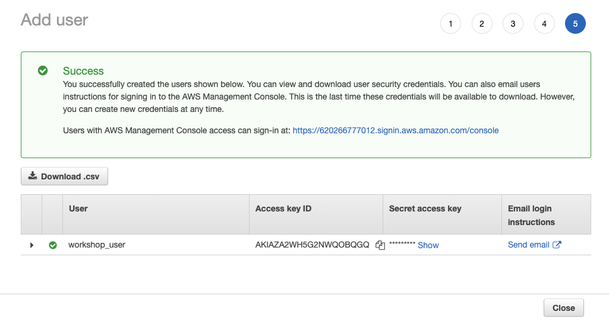
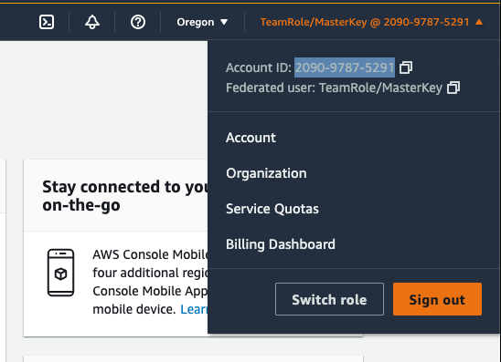
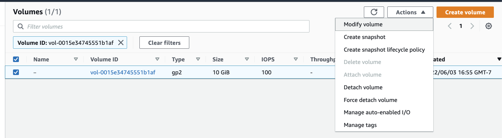
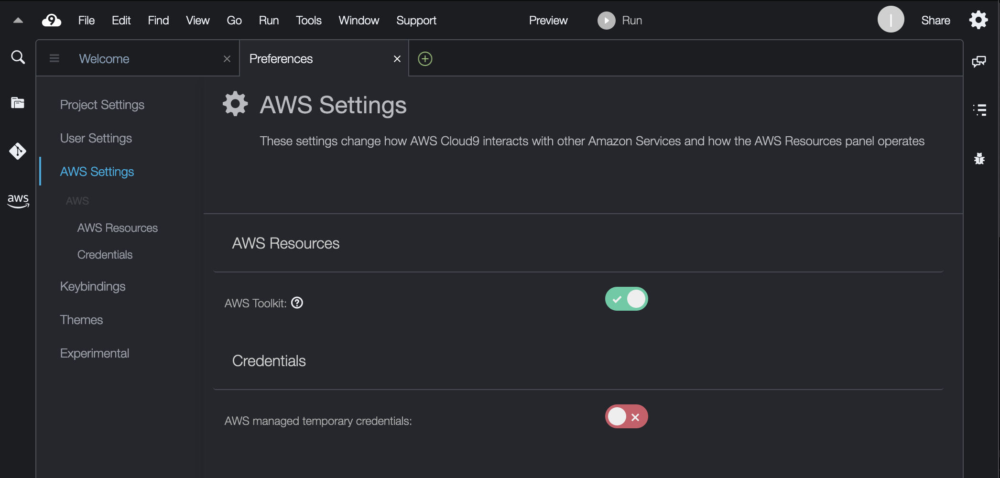

## 0. Prerequisites setup
This document describes how to set up your AWS account and Cloud9 IDE, which will be used to execute all of the steps in the workshop.

### 0.1. Setup AWS Account
For this workshop, you may use your own AWS account, or use an account generated by AWS Event Engine. If you are using your own AWS account, please proceed to Section 0.2. If you would like to receive a temporary AWS Account through AWS Event Engine follow these steps:

    1. Go to the Event Engine link provided by your workshop host
    2. Follow the on-screen instructions to gain access to your temporary AWS account

Once you have logged in successfully, proceed to create an IAM user.

### 0.2. Create IAM user with admin rights
Once logged into the account through the [AWS console](https://console.aws.amazon.com/console/home?region=us-west-2#), navigate to [IAM Users](https://console.aws.amazon.com/iamv2/home?#/users) and add a new user by clicking the **Add users** button and filling out the form as shown below. Use **inferentia_user** as the User Name. 
<div align="center">

<br/>
Fig. 0.1 - Add user screen
</div>
<br/>

Click **Next: Permissions** and click the **Create group** button on the screen. 

<div align="center">

<br/>
Fig. 0.2 - Set permissions screen
</div>
<br/>

Provide group name **admins** and select the **AdministratorAccess** policy as shown below.

<div align="center">

<br/>
Fig. 0.3 - Create group
</div>
<br/>

Click the **Create group** button and you will be brought back to the **Set permissions** screen. Select the **admins** group as shown on the figure below, then click **Next: Tags** .
<div align="center">

<br/>
Fig. 0.4 - Add user to admins group
</div>


Follow the wizard through to the end to create the user (remaining options can be left as default). When the user is added successfully, you will see a confirmation screen from which you can copy the user's Access Key and Secret Access Key. 
<div align="center">

<br/>
Fig. 0.5 - Confirmation screen with access key information for new user
</div>
<br/>

Click the **Download .csv** button to download the user's credentials as a `.csv` file. Alternatively you can press the **Show** link and copy/paste the **Access key ID** and **Secret access key** locally. You will need to enter the crecentials later while you are completing the exercises in this workshop. This is the only time these credentials will be available for download or display. You will be able to generate new credentials if necessary.

### 0.3) Sign into the AWS Console
In this step you will sign in to the AWS Console as the user you just created.
Pull down the user menu from your current AWS Console screen and copy the Account number displayed next to **My Account** as shown on the figure below.
<div align="center">

<br/>
Fig. 0.6 - Sign out of AWS Console
</div>
<br/>

Once you have copied the account number, cick **Sign Out**, then click **Sign In to the Console**.

<div align="center">

<br/>
Fig. 0.7 - Sign in landing screen
</div>
<br/>

On the **Sign in** screen select **IAM user**, enter the **Account ID** that you just copied, and click Next.

<div align="center">

<br/>
Fig. 0.8 - Sign in as IAM user
</div>
<br/>

When presented with the login screen shown below, fill in the IAM username and password that you created in the previous step.

Next, click the **Sign in** button and sign in as the new IAM user.

### 0.4. Setup Cloud9 IDE

Please verify that the `us-west-2` region **Oregon** is selected in your console and is showing in the upper right corner of your browser as highlighted in the figure below. We will use [Cloud9](https://us-west-2.console.aws.amazon.com/cloud9/home/product) to execute the steps in this workshop. To provision a Cloud9 IDE, click on the **Services** menu (from the top left of the screen) then select **Developer Tools** and choose **Cloud9**, or just open the following <a href="https://us-west-2.console.aws.amazon.com/cloud9/home/product" target="_blank">link to Cloud9</a>.

<div align="center">

<br/>
Fig. 0.9 - Cloud9 link
</div>
<br/>

Following the link will open the Cloud9 landing page.

<div align="center">

<br/>
Fig. 0.10 - Cloud9 landing page
</div>
<br/>

Click on the `Create environment` button.

<div align="center">

<br/>
Fig. 0.11 - Cloud9 name environment screen
</div>
<br/>

Type a name for your Cloud9 environment, then click `Next`.

<div align="center">

<br/>
Fig. 0.12 - Cloud9 configure settings screen
</div>
<br/>

Under **Instance type** selcet `Other instance type` and `c5.9xlarge`. Then click **Next step** and **Create environment**.
This will launch your Cloud9 instance. Provisioning of the instance can take a few minutes.

<div align="center">

<br/>
Fig. 0.13 - Cloud9 instance
</div>
<br/>

The default Cloud9 instance comes with a root EBS volume that is only 10GB in size. 

<div align="center">

<br/>
Fig. 0.14 - Cloud9 Manage EC2 Instance
</div>
<br/>

We will increase the root volume size, to avoid running out of space later in the workshop.
Click on the user icon in the upper-right corner and select **Manage EC2 Instance**.

<div align="center">

<br/>
Fig. 0.15 - Cloud9 EC2 Instance Storage
</div>
<br/>

Select the instance, then click on the **Storage** tab and click on the link under **Volume ID** to select the current root volume. 

<div align="center">

<br/>
Fig. 0.16 - Cloud9 EC2 Instance Volume
</div>
<br/>

Select the volume, then click on Actions and select **Modify volume**.

<div align="center">

<br/>
Fig. 0.16 - Cloud9 Modify Volume
</div>
<br/>

Increase the size of the volume by typing the desired size in the **Size (GiB)** field, then click **Modify**, and confirm.

<div align="center">

<br/>
Fig. 0.17 - Cloud9 volume optimizing
</div>
<br/>

The volume status changes to **In-use - modifying** and in a few seconds becomes **In-use - optimizing**. As soon as the status changes to **optimizing** we need to reboot the instance in order for the resized volume to become available in Cloud9.

<div align="center">

<br/>
Fig. 0.18 - Cloud9 reboot instance
</div>
<br/>

To reboot the instance, select **Instances** from the console navigation menu, then highlight the instance and select **Instance state -> Reboot**.

<div align="center">

<br/>
Fig. 0.19 - Cloud9 IDE with resized volume
</div>
<br/>

Once the instance is restarted, refresh the Cloud9 IDE window and type `df -h` in the terminal window. You should see that the root volume has the size you specified earlier.

Open the IDE Preferences by clicking on the settings icon in the upper-right corner of the screen, or by clicking the Cloud9 icon in the menu and selecting Preferences. Scroll the list of preferences down and selct the `AWS Settings` section. Disable the `AWS managed temporary credentials` setting as shown below.

<div align="center">

<br/>
Fig. 0.20 - Disable Cloud9 IDE `AWS managed temporary credentials` setting
</div>
<br/>


### 0.5 Clone workshop repository

```
git clone https://github.com/aws-samples/aws-distributed-training-workshop-eks.git
```

and

```
cd aws-distributed-training-workshop-eks
```

Your Cloud9 work environment is now completely set up and you are ready to dive into the [Distributed Model Training Workshop for AWS EKS](README.md).
